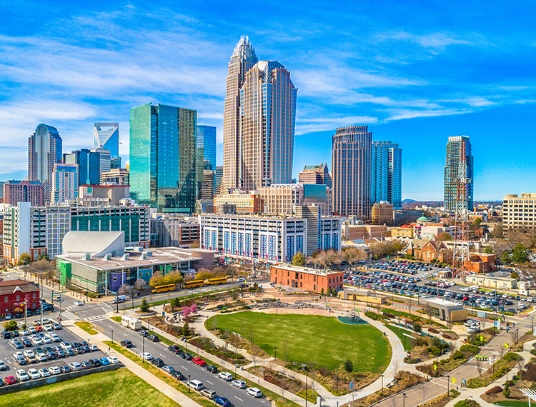
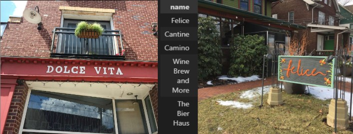

# Nom-Native

The app that I've developed is a restaurant recommendation app that takes data from a specific beloved restaurant in the user's hometown and uses that information to find the closest match in their new stomping grounds. The app would allow users to plug in their favorite restaurants, bars, and hip date night spots, and then search for their counterpart in their new city. Making it a valuable resource for anyone looking to explore their new home's culinary scene.

## The Business Case

Yelp is a popular online platform that provides user-generated reviews and recommendations for local businesses, including restaurants. Adding the functionality of this app would be a valuable addition to the platform. It would help Yelp to expand its user base by attracting people who are moving to new cities and looking for their new spots. By offering this functionality, Yelp could also increase user engagement, as users would be more likely to continue using the platform even after they have moved to a new location. Additionally, this feature could help Yelp to differentiate itself from competitors.

**1.  People are The Same**

Despite being born in different states or regions, we are all fundamentally the same, maybe not Texas.
It doesn't matter where you're from, you can make your new home wherever you'd like, and we can help.


**2.  Subjectivity**

This is what defines us as individuals, how we see the world and the places we choose to spend our time is unique.
It doesn't help us find our new go-to Chinese Takeout place by searching the best Chinese Restaurants, all review systems are flawed
They punish long standing restaurants while pushing new ones to the top, they snapshot mismanagement and make it immortal, do you
really want to miss out on the best Korean Fried Chicken just because 2 years ago people just would not shut up about some light 
listeriosis?

## The Problem

We've just discussed how broken the system is, how flawed and unreliable it can be, so how do we solve it?
By throwing absolutely every aspect of recordable feature data to the wall and seeing if we can find some symmetry is this crazy mixed up world

## How Do We Get There?

This is How I did it.


## Step 1:  Gathering Data

This is a proof of concept so instead of scraping all of Yelp's data, I opted for around 5.3 million reviews over 152 thousand businesses
The nature of this very project is more ethereal in if it's successful, so I chose my homestate of NC where I could at least verify some accuracy by choosing places I've been, the dataset contained over 11 thousand businesses
the closest to it was Ohio, despite being a terrible place that no one should ever visit, I had the data to compare.


## Sentiment Analysis

I used NLTK's Vader analysis tool to aggregate all the review data and how it correlated with star rating, combined all of the business into one and generating
more exact star rating values.

While it proved somewhat statistically unremarkable it was a nice glimpse into how sentiment does or does not correlate with star rating.


## Data Cleaning

The next step was combining two data sets to get categorical data and business feature data for each entry, I trimmed off excess columns and redundancies in
the data. Next I had to one hot encode all categorical data into numerical data for comparison from one state to the next.

## Putting it Together

Finally I joined the vaderized data set with the feature set by their restaurant id. 
I then wrote a function that computes Euclidean distance between a chosen restaurant matched against all rows in other state's database.
It then prints out the top 5 names of what restaurants are mostly correlated.
    
    # The Function
    def find_similar_rows(nc, oh, row_index):
    # Get the specified row from the first dataframe
    row = nc.iloc[row_index]

    # Compute the Euclidean distance between the specified row and all rows in the second dataframe
    distances = np.linalg.norm(oh - row, axis=1)

    # Find the indices of the 5 smallest distances
    min_distance_indices = np.argsort(distances)[:5]

    # Return the top 5 rows in the second dataframe with the smallest distance to the specified row
    return oh.iloc[min_distance_indices]
    



## Conclusions

This project was a bit lofty in it's pursuits but based on my fledgling coding and data science skills I do believe it performs adequately, all there is left
to do now is test it myself.
Further expansion of this project would definitely be more specific scraping of up to date data, specific city wide data instead of state, and even the addition of other review websites to really round out the whole shebang.

```
├── Data                          <- Data Source
├── Images                        <- Images Folder
├── Notebooks                     <- Notebooks Folder
├── .gitignore                    <- gitignore
├── Capstone.pdf                  <- PDF version of project presentation
├── Final Notebook.ipynb          <- Final Notebook
└── README.md                     <- ReadMe
```
